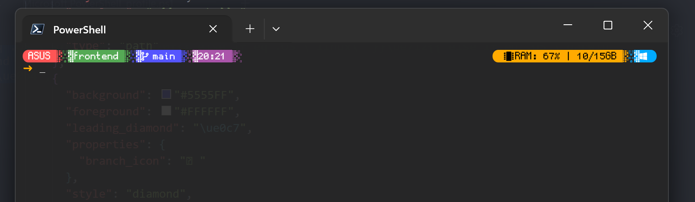
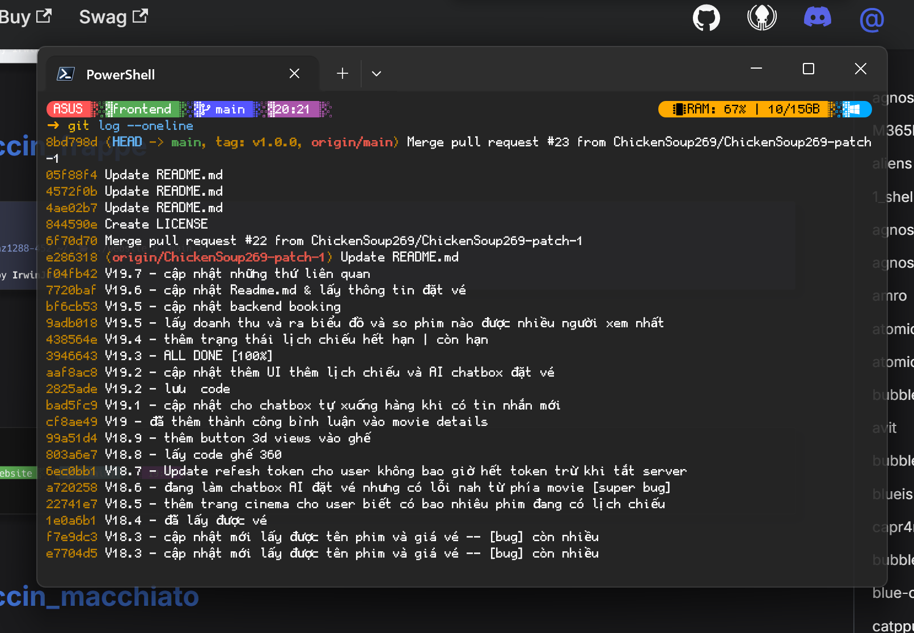

## Custom Themes Oh-my-posh

### cert x clean-detailed [with font pixel]

**How to custom**

1.  Copy theme {name}.omp.json về thư mục bạn có quyền sửa

```bash
Copy-Item "$env:POSH_THEMES_PATH\cert.omp.json" "$HOME\pixel_custom.omp.json"
```

2. Sửa PowerShell profile để dùng theme mới

```bash
notepad $PROFILE
```

Thay dòng hiện tại bằng:

```bash
oh-my-posh init pwsh --config "$HOME\pixel_custom.omp.json" | Invoke-Expression
```

3. Mở file atomic_custom.omp.json để chỉnh code

```bash
notepad "$HOME\pixel_custom.omp.json"
```

<p align="center">  </p>

<p align="center">  </p>

## TẢI OH MY POSH

https://ohmyposh.dev/docs/installation/windows
https://ohmyposh.dev/docs/themes
